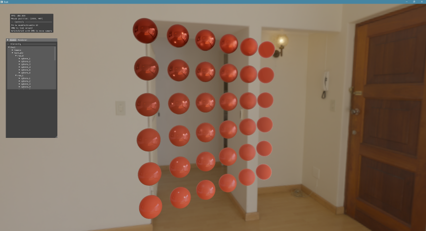
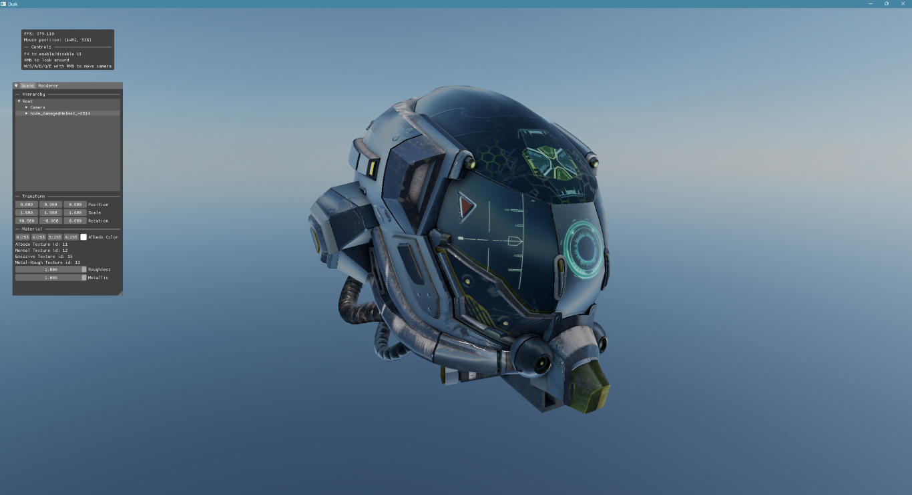

# Dusk Rendering Engine

**Dusk** is a modern experimental real-time rendering engine built with a focus on GPU-driven architecture, explicit control, and modern Vulkan techniques. It serves as a research workbench for building applications for learning advanced rendering systems and engine architecture design.

---

## Overview

Dusk is a **Vulkan-only renderer** written in **C++**, currently supporting **Windows** platform.

The engine emphasizes:

- Explicit GPU control
- Data-oriented design
- Modern rendering techniques
- Scalable architecture
- Debuggability

This project is intended as a **technical renderer framework** for experimentation, optimization, and graphics research rather than a full production game engine.


## Key Features

### Rendering Architecture
- **RenderGraph system**
	- Synchronization handling
	- Topological sort for scheduling
	- Resource lifetime & usage tracking
	- Graph visualization using Graphviz  
- **GPU-driven rendering**
- Fully **bindless resource system**
- Multithreaded command buffer recording
- Deferred rendering pipeline
- Async transfer support

### Modern Vulkan Features
- Dynamic Rendering
- Sync2 synchronization
- Descriptor Indexing
- Multiview
- MultiDrawIndirectCount

### Rendering Features
- PBR metallic-roughness workflow
- Image based lighting
- Directional, point and spot lights support
- Basic shadow rendering
- HDR Skybox
- GPU driven culling and LOD calculation

### Scene & Tools
- ECS-based scene architecture
- ImGui runtime UI
- Scene graph inspector
- Live component editing
- Runtime performance stats

### Asset Support
- GLTF scene loading
- Multithreaded texture uploads
- KTX texture support
- Environment map preprocessing sample:
  - Radiance cubemap generation
  - Prefiltered environment maps
  - BRDF LUT generation


## Architecture Philosophy

Dusk is built around the following principles:

- Prefer GPU work over CPU work
- Avoid hidden synchronization
- Make data ownership explicit
- Favor systems over objects
- Design for debugging first
- Keep systems modular and inspectable

## Gallery

**GPU:** RTX 3060  
**CPU:** AMD Ryzen 7 5700X 8-Core Processor 






## Work In Progress

- RenderGraph texture aliasing
- Graph visualization tooling (Graphviz integration)
- Expanded RenderGraph pass support
- Improved async compute scheduling


## Roadmap

### Rendering
- SSAO / RTAO
- Tone mapping
- Cascaded shadow maps
- Anti-aliasing techniques
- Forward+ transparency
- Ray tracing pipeline support

### GPU Systems
- Visibility buffer GPU sorting and  batching
- Async compute and transfers integration into RenderGraph
- Mip streaming system

### Debugging Tools
- AABB visualization
- ImGui gizmos
- Secondary debug camera for culling / occlusion debugging

### Memory Systems
- Thread-local stack allocators
- CPU arena allocators
- GPU heap arenas

## Build Instructions

```bash
git clone <repo>
cd dusk
cmake -B build
cmake --build build
```

## Dependencies
- Vulkan 1.3
- Assimp
- Entt
- Excalibur Hash
- GLFW
- GLM
- Imgui
- KTX
- Spdlog
- Taskflow
- Tracy
- VMA
- VOLK


## Resources

## Assets Credits


## Development Status

This project is under active development and architecture may evolve frequently.  
Feedback, ideas, and technical discussion are welcome.

## License

MIT License

---

