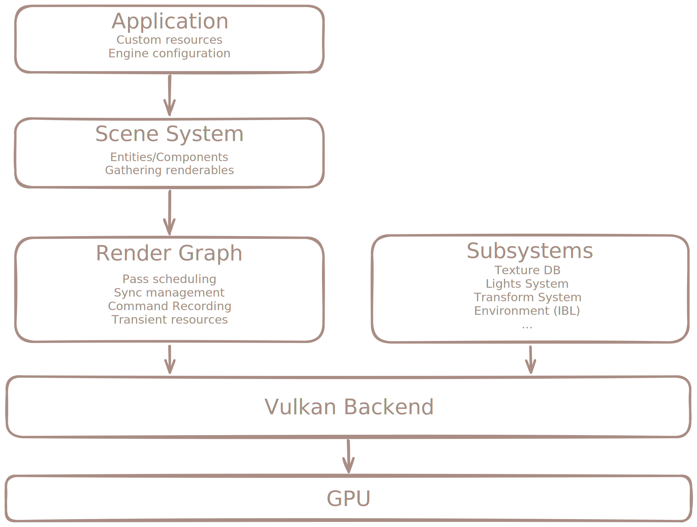
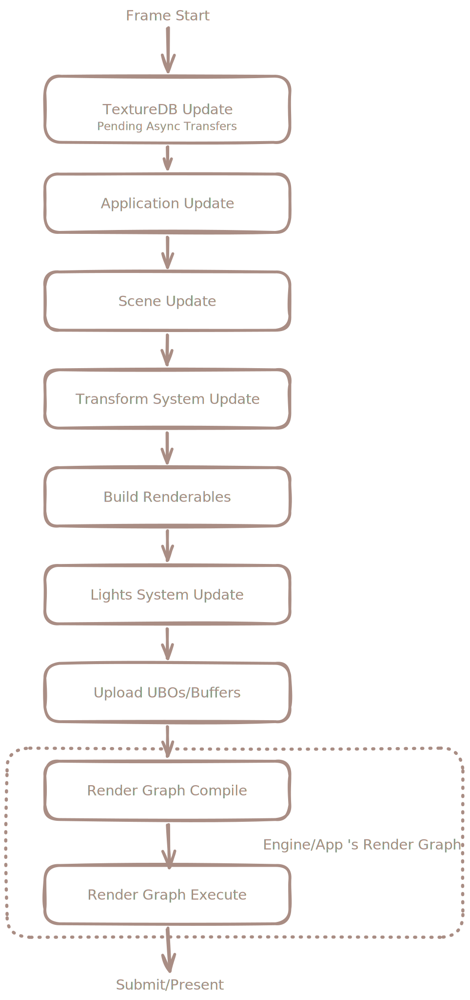
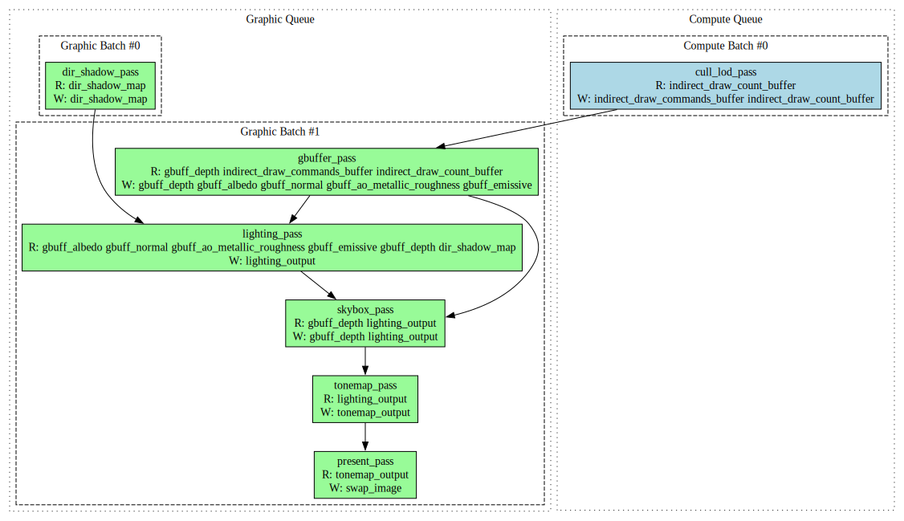
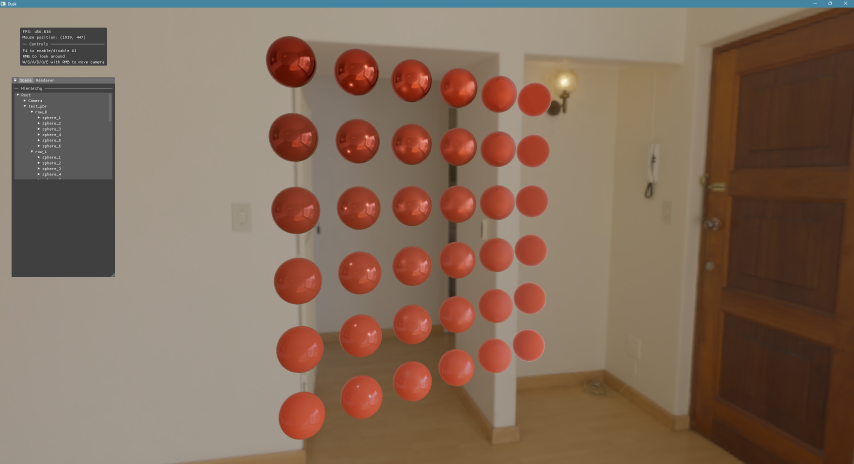
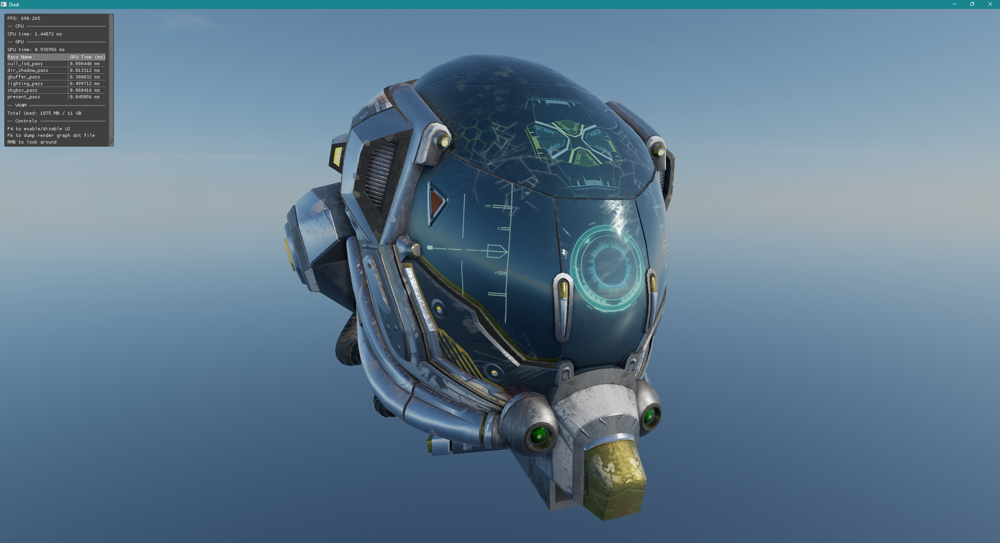
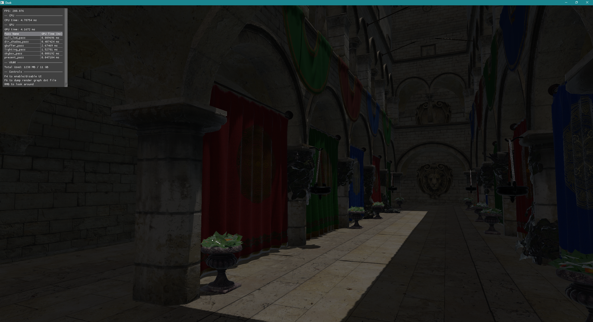

[](https://opensource.org/licenses/MIT)
[](https://trello.com/b/OOKowW4p/dusk) 

# Dusk Rendering Engine

**Dusk** is a modern experimental real-time rendering engine built with a focus on GPU-driven architecture, explicit control, and modern Vulkan techniques. It serves as a research workbench for building applications for learning advanced rendering systems and engine architecture design.

---

## Overview

Dusk is a **Vulkan-only renderer** written in **C++**, currently supporting **Windows** platform.

The engine emphasizes:

- Explicit GPU control
- Data-oriented design
- Modern rendering techniques
- Scalable architecture
- Debuggability

This project is intended as a **technical renderer framework** for experimentation, optimization, and graphics research rather than a full production game engine.


## Key Features

### Rendering Architecture
- **RenderGraph system**
	- Synchronization handling
	- Topological sort for scheduling
	- Async Compute support
	- Resource lifetime & usage tracking
	- Graph visualization using Graphviz  
- **GPU-driven rendering**
- Fully **bindless resource system**
- Multithreaded command buffer recording
- Deferred rendering pipeline
- Async transfer support

### Modern Vulkan Features
- Dynamic Rendering
- Sync2 synchronization
- Descriptor Indexing
- Multiview
- MultiDrawIndirectCount

### Rendering Features
- PBR metallic-roughness workflow
- Image based lighting
- Directional, point and spot lights support
- Basic shadow rendering
- HDR Skybox
- GPU driven culling and LOD calculation

### Scene & Tools
- ECS-based scene architecture
- ImGui runtime UI
- Scene graph inspector
- Live component editing
- Runtime performance stats

### Asset Support
- GLTF scene loading
- Multithreaded texture uploads
- KTX texture support
- Environment map preprocessing sample:
  - Radiance cubemap generation
  - Prefiltered environment maps
  - BRDF LUT generation


## Architecture Philosophy

Dusk is built around the following principles:

- Prefer GPU work over CPU work
- Avoid hidden synchronization
- Make data ownership explicit
- Favor systems over objects
- Design for debugging first
- Keep systems modular and inspectable

## Architecture Diagrams

<p align="left">
  <br>
  <em>High level architecture of Dusk</em>
</p>

<p align="left">
  <br>
  <em>Frame flow in Dusk</em>
</p>

<p align="left">
  <br>
  <em>Rendergraph for deferred rendering system in Dusk</em>
</p>

<p align="left">
  <br>
  <em>Mulitple Queue family utilization</em>
</p>

## Gallery

**GPU:** RTX 3060  
**CPU:** AMD Ryzen 7 5700X 8-Core Processor 








*Amazon Lumberyard Bistro scene with 4M triangles*

## Work In Progress

- RenderGraph texture aliasing
- Expanded RenderGraph pass support

## Roadmap

### Rendering
- SSAO / RTAO
- Tone mapping
- Cascaded shadow maps
- Anti-aliasing techniques
- Forward/OIT transparency
- Ray tracing pipeline support

### GPU Systems
- Visibility buffer GPU sorting and  batching
- Mip streaming system

### Debugging Tools
- AABB visualization
- ImGui gizmos
- Secondary debug camera for culling / occlusion debugging

### Memory Systems
- Thread-local stack allocators
- CPU arena allocators
- GPU heap arenas

## Build Instructions

```bash
git clone <repo>
cd dusk/<choose sample>
cmake -B build
```

## Dependencies
- [Vulkan 1.3](https://www.vulkan.org/)
- [Assimp](https://github.com/assimp/assimp)
- [Entt](https://github.com/skypjack/entt)
- [Excalibur Hash](https://github.com/SergeyMakeev/ExcaliburHash)
- [GLFW](https://github.com/glfw/glfw)
- [GLM](https://github.com/g-truc/glm)
- [Imgui](https://github.com/ocornut/imgui)
- [KTX](https://github.com/KhronosGroup/KTX-Software)
- [Spdlog](https://github.com/gabime/spdlog)
- [Taskflow](https://github.com/taskflow/taskflow)
- [Tracy](https://github.com/wolfpld/tracy)
- [VMA](https://github.com/GPUOpen-LibrariesAndSDKs/VulkanMemoryAllocator)
- [VOLK](https://github.com/zeux/volk)


## Resources
- Writing an efficient Vuklan renderer. [Link](https://zeux.io/2020/02/27/writing-an-efficient-vulkan-renderer/)
- Keen games Vulkan backend. [Link](https://github.com/keengames/vulkan_backend)
- Frostbite's FrameGraph. [Link](https://www.gdcvault.com/play/1024612/FrameGraph-Extensible-Rendering-Architecture-in)
- LearnOpenGL articles. [Link](https://learnopengl.com/)

## Assets Credits
- Sponza GLTF model. [Link](https://github.com/KhronosGroup/glTF-Sample-Assets/tree/main/Models/Sponza)
- Damaged Helmet GLTF model. [Link](https://github.com/KhronosGroup/glTF-Sample-Assets/tree/main/Models/DamagedHelmet)
- Amazon Lumberyard Bistro. [Link](https://developer.nvidia.com/orca/amazon-lumberyard-bistro)
- Models and HDR environment. [Link](https://polyhaven.com)
- HDR sky. [Link](https://ambientcg.com)

## Development Status

This project is under active development and architecture may evolve frequently.  
Feedback, ideas, and technical discussion are welcome. Track development [here](https://trello.com/b/OOKowW4p/dusk) on Trello.

## License

MIT License

---

